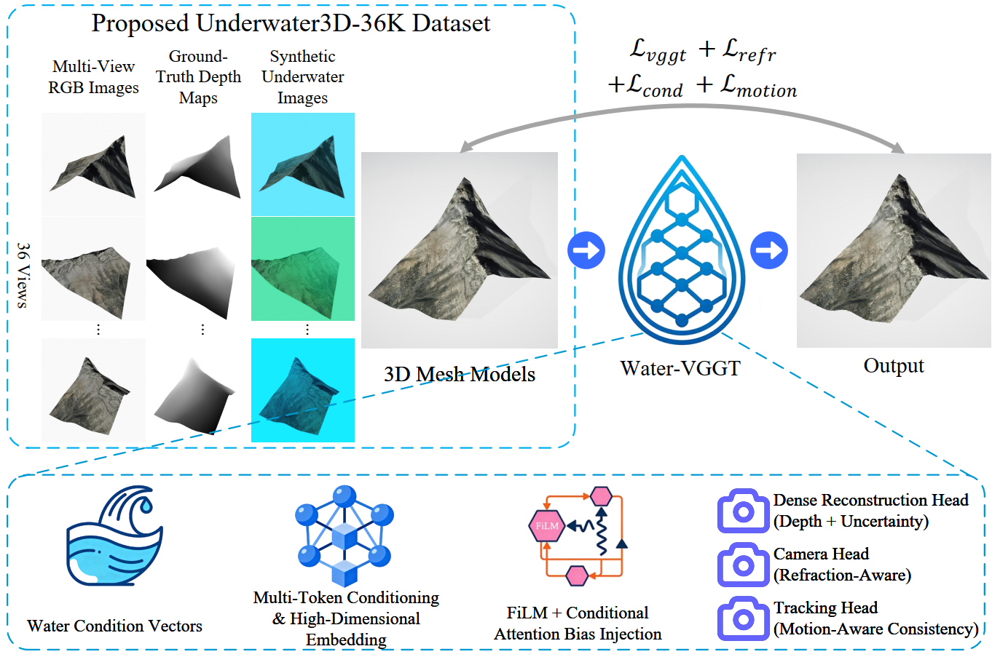

# Water-VGGT: Leveraging Visual Geometry and Water-Optics for Robust 3D Reconstruction in Underwater Environments

## Abstract
Underwater 3D reconstruction is severely challenged by complex optical distortions caused by refraction at camera interfaces, particle scattering, and wavelength-dependent attenuation. These effects violate the assumptions of conventional multi-view reconstruction methods. 

**Water-VGGT** is a physically conditioned deep framework for robust underwater 3D reconstruction. It introduces a **Water Condition Vector** representing key physical factors such as refractive parameters, visibility, scattering intensity, and spectral attenuation. An alternatingly conditioned Transformer backbone adapts feature interactions and geometric reasoning to diverse underwater conditions. Condition-aware prediction modules improve reconstruction stability under severe optical degradation. Extensive experiments demonstrate superior geometric accuracy and robustness compared with existing methods. The code and dataset are publicly available for reproducible research and benchmarking.

## System Overview
  
*Figure 1: Illustration of Water-VGGT framework. Multi-view underwater images are processed via a physically conditioned Transformer backbone with Water Condition Vector modulation, producing robust 3D reconstruction outputs.*

## Dataset
We provide a large-scale synthetic dataset **Underwater3D-36K** for training and evaluation:

- 1,000 unique scenes  
- 36 multi-view underwater images per scene  
- Corresponding ground-truth 3D meshes  
- Diverse optical conditions including scattering, attenuation, and refraction

The dataset can be downloaded from:  
[OneDrive link](https://1drv.ms/f/c/bb3d431e33a5aa64/IgAwfGKqHBVaSomPhk8RqUDZAW02UIQmUvsOQdf2sopbCZM?e=j9GqHO)


## Environment
Install the required packages:

```bash
pip install torch==2.3.1 torchvision==0.18.1 numpy==1.26.1 Pillow huggingface_hub einops safetensors
```

## Pretrained Model
Download the pretrained Water-VGGT model:
[OneDrive link](https://1drv.ms/u/c/bb3d431e33a5aa64/IQBGU9OAo-6sSajdSJk8SRotAaDePYzjIA32J-egCg9vQm0?e=jfALQG)

## Usage
Demo

Run the demo with:
```bash
python demo.py
```
Note: Training and testing code will be released upon acceptance of the paper.


Training

Launch training using the provided Trainer:
```bash
python training/trainer.py --config-name your_config.yaml
```

## Validation

Validation is performed automatically during training at the configured epoch frequency:
```bash
trainer.run_val()
```

## About the Author

This project is developed and maintained by Yifan Liu,
[More about the author](https://awhitewhale.github.io/liuyifan/).